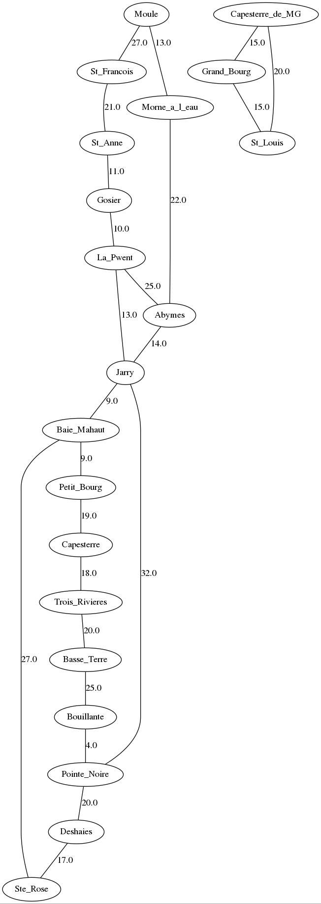
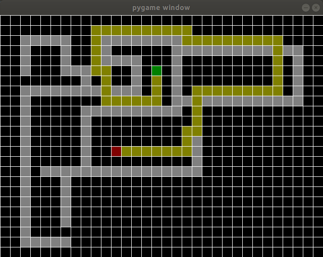
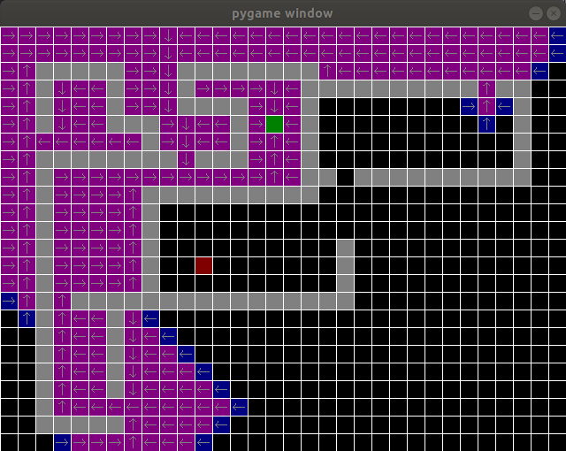

# L3_Graphes
Cours de Graphes et Applications, université des Antilles,
en Licence Informatique 3eme année. Partie V. Pagé.

Vous trouverez au sein de ce projet :
- une librairie en Python permettant de manipuler des Graphes
- les supports de cours et de TP
- une application des parcours de graphes aux problèmes
de recherche de chemins (ou **pathfinding**) dans les jeux vidéo (pour ceux
que cela intéresse, je vous recommande l'excellent site
[https://www.redblobgames.com/](https://www.redblobgames.com/) qui parle
de ceci et de bien d'autres choses...).

## Visualisation des graphes.
Vous verrez que créer des petits graphes sera relativement facile avec notre
librairie. Mais il nous faudra surtout visualiser ces graphes pour voir si nous
avons bien crée le graphe que nous voulions.

Faire une librairie de visualisation de graphes efficace est très difficile
(C'est un domaine de recherche en informatique). Nous allons donc utiliser une
librairie existante, parmi les plus utilisées au monde : **graphviz**

Pour la visualisation des graphes, chacun de nos graphes devra pouvoir être sauvegardé
dans un fichier texte (format **.dot**) qui sera utilisé par la librairie
**graphviz** pour la visualisation.
Tous les fichiers d'exemples génèrent un fichier **.dot** que vous pourrez tester.

La librairie s'installe facilement sur les machines linux.
- Si c'est votre cas, vous pourrez utiliser le script **lancerGraphviz.sh** qui
transforme chaque fichier **.dot** en fichier png.
- Si vous ne pouvez pas installer **graphviz**, vous utiliserez une version
online de graphviz. Il en existe beaucoup.
[http://www.webgraphviz.com/](http://www.webgraphviz.com/) en est un bon exemple.
Dans ce cas : ouvrez un fichier **.dot**, copiez son contenu et collez le dans
le formulaire de la page dont je viens de vous fournir l'adresse.
Appuyez sur "Generate Graph" et observez votre graphe...

## La nouvelle librairie de graphes (en Python)

Pour le moment sont implémentés :

- les graphes orientés
- les graphes non orientés
- les graphes orientés valués
- les graphes non orientés valués

La librairie est dans [Sources/GraphLib/](Sources/GraphLib)
Chaque type de graphe à son fichier.
Par exemple le graphe orienté est codé dans
[Sources/GraphLib/DirectedGraph.py](Sources/GraphLib/DirectedGraph.py).

Chaque classe est exploitée par un main situé dans [Sources/](Sources/).

On pourra donc tester les graphes orientés avec le main contenu dans
[Sources/testDirectedGraph.py](Sources/testDirectedGraph.py)
Vous pouvez lancer ce fichier qui vous générera un fichier **.dot** fonctionnel.
Je vous invite à regarder le contenu d'un fichier de type **.dot**...

Le fichier [Sources/gwadada.py](Sources/gwadada.py) crée un graphe simplifié
du réseau routier de Guadeloupe, avec comme poids d'aretes le temps approximatif
de route entre deux villes. Notez que la visualisation ne prend que très
partiellement en compte la géographie de notre pays... (je n'ai pas inséré la Désirade et les Saintes par manque de temps. Désolé)

## documentation de la librairie :

La librairie est autodocumentée. Le code contient des commentaires de type **docstring** que j'espere relativement clairs.

Mais ce type de documentation permet aussi de générer une documentation qui permet de se servir des classes sans meme regarder le code.

**ATTENTION :** Cette documentation n'est pas visible depuis les pages github (je n'y arrive pas !). En revanche, si vous clonez ou downloadez
le projet L3_Graphes, cette documentation est visible depuis le fichier
*Sources/docs/_build/html/index.html*

## Illustration du parcours en largeur :
Au delà des parcours de Graphes dans des vrais graphes,
il arrive que l'on utilise ces algorithmes sans même disposer d'une structure
de graphes. C'est souvent le cas en Path Finding : la recherche d'un chemin dans un
labyrinthe, que l'on retrouve souvent dans des jeux.

Lancez le programme dont le code est dans .
vous comprendrez mieux ensuite.

Sinon, voici 2 captures d'écran :
Vous cherchez un chemin dans un labyrinthe.
- Les murs sont en gris,
- le point de départ est vert
- l'arrivée est rouge.
- Le chemin le plus court trouvé par l'algorithme est en jaune.

Pour bien comprendre le fonctionnement,
vous pouvez d'abord regarder le cours (...) puis executer l'algo pas à pas.

Vous verrez alors :
- l'ensemble des Sommets à faire en bleu.
- l'ensemble des sommets déja traités en violet
- une représentation de la table de prédécesseur qui dit comment acceder à un point sous forme de fleche sur chaque case.

L'interface est minimaliste :

- cliquez sur une case pour creer un mur ou en supprimer un.
- appuyez sur "s" (start) puis cliquez sur une case pour définir le point de départ
- appuyez sur "e" (end) puis cliquez sur une case pour définir l'arrivée
- appuyez sur "r" (run) pour lancer la recherche de chemin
- appuyez sur "n" (next) pour lancer la recherche de chemin step by step

pour voir la table des predecesseurs en construction,
lancer la recherche en step by step.

Quel est le graphe qui est caché la dessous ?

## Le cours :
- [Introduction](Cours/00_Intro.md)
- [Cours 1](Cours/01_Cours1.md)
- [Cours 2](Cours/02_Cours2.md)
